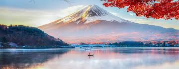

# 🗾 Voyage au Japon - Guide Complet

---

## ✨ Bienvenue dans le Pays du Soleil Levant

> 🎌 *Le Japon est une destination magique où la tradition rencontre la modernité*

Découvrez un pay fascinant avec ses paysages, sa culture riche et ses traditions millénaires.

cliker sur ce lien pour en savoir plus :[office tourisme japonnais](https://www.japan.travel/fr/fr/)

---

## 📍 Régions Principales

### **Honshu** 🏔️
La plus grande île du Japon, abritant:
- *Tokyo* - **La capitale vibrante** et moderne
- *Kyoto* - Le cœur traditionnel du Japon
- *Osaka* - La ville de la cuisine savoureuse
  
.

### **Hokkaido** ❄️
1. *Sapporo* - **Connue pour son festival de neige**
2. Montagnes majestueuses et sources chaudes
3. *Nature préservée* et paysages alpins


---

## 🎎 Culture et Traditions

| Aspect | Description | Saison |
|--------|-------------|--------|
| **Sakura** 🌸 | Floraison des cerisiers | *Printemps* |
| **Matsuri** 祭 | Festivals traditionnels | **Été** |
| **Koyo** 紅葉 | Feuillages d'automne | *Automne* |
| **Yuki** ⛄ | Paysages enneigés | **Hiver** |

---
## 🎟️ Les Manga les plus connue 

- Shonen
  - 1. HunterxHunter 🃏
  - 2. Full Metal alchimiste 🦾
  - 3. One Piece 👒

- Isekai
    1. Moi quand je me reincarne en slime 🦠
    2. rising of shiel heroes 🛡️
---
## 🍜 Gastronomie Japonaise

### Plats Incontournables

1. **Sushi & Sashimi** 🍣
   - *Frais du marché* chaque jour
   - **Préparation minutieuse** selon les règles

2. **Ramen** 🍜
   - Bouillon riche et savoureux
   - *Nouilles ondulées* parfaites

3. **Tempura** 🍤
   - **Beignets croustillants** à la japonaise
   - Légumes et fruits de mer

4. *Kaiseki* - ***Le summum de la gastronomie japonnaise***

---

## 🏯 Attractions Touristiques

### Incontournables ⭐⭐⭐

>  **Ne pas manquer ces sites extraordinaires**

- [ ] Temple Fushimi Inari à Kyoto (10 000 torii 🏮)
- [ ] Mont Fuji 🗻 - *Le symbole du Japon*
- [ ] Château Himeji - **Chef-d'œuvre architectural**
- [ ] Shibuya Crossing à Tokyo - *La plus grande croisement du monde*
- [ ] Arashiyama Bamboo Grove - Bambous géants

### Expériences Authentiques 🎌

- ***Nuit dans un ryokan traditionnel***
- **Cours de cuisine** japonaise
- *Bains onsen* avec vue montagne
- **Cérémonie du thé** guidée
- *Marche à travers les temples*

---

## 🌸 Meilleure Période pour Visiter

```
    PRINTEMPS (Mars-Mai)           AUTOMNE (Sept-Nov)
    🌸 Sakura en fleur              🍂 Couleurs sublimes
    Température: 15-25°C            Température: 15-25°C
    ★★★★★ Recommandé               ★★★★★ Recommandé
```

## 🎯 Phrases Utiles

| Français | Japonais | Prononciation |
|----------|----------|--------------|
| **Bonjour** | こんにちは | *Konnichiwa* |
| *Merci* | ありがとう | **Arigatou** |
| **S'il vous plaît** | お願いします | *Onegaishimasu* |
| *Excusez-moi* | すみません | **Sumimasen** |

---

## 🌟 Conclusion

> 🗾 ***Le Japon vous attend avec ses mystères et ses merveilles***

**Embarquez pour une aventure inoubliable** où chaque instant vous surprendra. Que ce soit les temples millénaires, la technologie futuriste ou la cuisine exquise, le Japon saura vous **enchanter et vous transformer**.

*Bon voyage!* 🛫✨

---

**Dernière mise à jour:** Janvier 2026 | 📍 *Tokyo, Kyoto, Osaka* | 🎌 **Explorez, Apprenez, Découvrez**

